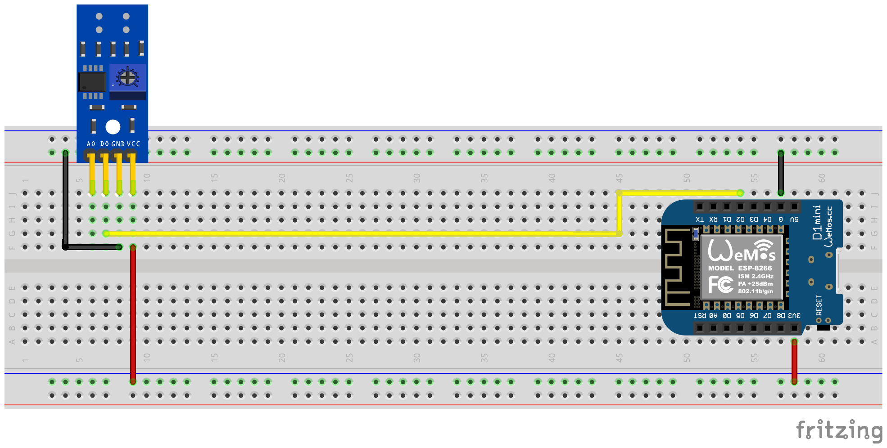

# ESPHome Ferraris Meter
> [!NOTE]
> This is the German version, for the English version, scroll down or click [here](#esphome-ferraris-meter-english).

Ferraris Meter ist eine ESPHome-Komponente zur Erstellung einer ESP-Firmware, die mithilfe eines ESP-Mikrocontrollers und eines Infrarotsensors die Geschwindigkeit und die Umdrehungen der Drehscheibe eines analogen Ferraris-Stromzählers ermitteln und daraus den momentanen Stromverbrauch und den Zählerstand berechnen kann. Diese Werte können dann zur weiteren Verarbeitung an eine Hausautomatisierungs-Software wie beispielsweise Home Assistant geschickt werden.

- [Haftungsausschluss](#haftungsausschluss)
- [Lizenz](LICENSE)
- [Hardware-Aufbau](#hardware-aufbau)
- [Software-Konfiguration](#software-konfiguration)
  - [Ferraris-Komponente](#ferraris-komponente)
  - [API/MQTT-Komponente](#apimqtt-komponente)
  - [WiFi-Komponente](#wifi-komponente)
  - [Sensoren](#sensoren)
    - [Primäre Sensoren](#primäre-sensoren)
    - [Diagnostische Sensoren](#diagnostische-sensoren)
  - [Aktionen](#aktionen)
  - [Schalter](#schalter)
- [Anwendungsbeispiele](#anwendungsbeispiele)
  - [Kalibierungsmodus](#kalibierungsmodus)
  - [Manuelles Überschreiben des Zählerstands](#manuelles-überschreiben-des-zählerstands)
    - [Händisches Setzen des Zählerstands über das User-Interface](#händisches-setzen-des-zählerstands-über-das-user-interface)
    - [Automatisiertes Setzen des Zählerstands](#automatisiertes-setzen-des-zählerstands)
  - [Wiederherstellung des Zählerstands nach einem Neustart](#wiederherstellung-des-zählerstands-nach-einem-neustart)
- [Hilfe/Unterstützung](SUPPORT.md)
- [Mitwirkung](CONTRIBUTING.md)
- [Bekannte Probleme](https://github.com/jensrossbach/esphome-ferraris-meter/issues?q=is%3Aissue+is%3Aopen+label%3A%22known+issue%22)

## Haftungsausschluss
**DIE SOFTWARE WIRD OHNE MÄNGELGEWÄHR UND OHNE JEGLICHE AUSDRÜCKLICHE ODER STILLSCHWEIGENDE GEWÄHRLEISTUNG, EINSCHLIEẞLICH, ABER NICHT BESCHRÄNKT AUF DIE GEWÄHRLEISTUNG DER MARKTGÄNGIGKEIT, DER EIGNUNG FÜR EINEN BESTIMMTEN ZWECK UND DER NICHTVERLETZUNG VON RECHTEN DRITTER, ZUR VERFÜGUNG GESTELLT. DIE AUTOREN ODER URHEBERRECHTSINHABER SIND IN KEINEM FALL HAFTBAR FÜR ANSPRÜCHE, SCHÄDEN ODER ANDERE VERPFLICHTUNGEN, OB IN EINER VERTRAGS- ODER HAFTUNGSKLAGE, EINER UNERLAUBTEN HANDLUNG ODER ANDERWEITIG, DIE SICH AUS ODER IN VERBINDUNG MIT DER SOFTWARE ODER DER NUTZUNG ODER ANDEREN GESCHÄFTEN MIT DER SOFTWARE ERGEBEN.**

## Hardware-Aufbau
Hardware-seitig wird lediglich ein ESP-Mikrocontroller (z.B. ESP8266 oder ESP32, inkl. Spannungsversorgung) und ein Infrarotsensor (z.B. TCRT5000) benötigt. Für die reine Funktionalität des Ferraris Meters reicht ein ESP8266 als Mikrocontroller völlig aus. Für den Infrarotsensor gibt es fertige TCRT5000-basierte Breakout-Module mit 3,3V-5V Eingangsspannung, die auch über einen regelbaren Widerstand (Potentiometer) verfügen, um die Empfindlichkeit des Sensors einzustellen. Diese TCRT5000-Module haben 4 Pins - VCC und GND für die Stromversorgung des Sensor-Chips sowie einen digitalen Ausgang D0 und einen analogen Ausgang A0. Der analoge Ausgang wird nicht benötigt, die anderen Pins müssen mit den entsprechenden Pins des Mikrocontrollers verbunden werden. Für VCC sollte der 3,3V-Ausgang des ESPs verwendet werden und der digitale Ausgang D0 muss mit einem freien GPIO-Pin (z.B. GPIO4, entspricht dem Pin D2 auf dem D1 Mini) verbunden werden.

Der folgende Steckplatinen-Schaltplan zeigt ein Beispiel für einen Versuchsaufbau mit einem ESP8266 D1 Mini Entwicklungsboard als Mikrocontroller.



Beim Platzieren des Sensors auf der Abdeckplatte des Ferraris-Stromzählers ist ein wenig Geschick und Präzisionsarbeit gefragt. Das Infrarot Sender/Empfänger-Paar des Sensors muss mittig millimetergenau über der Drehscheibe ausgerichtet werden und geradlinig auf die Drehscheibe zeigen. Mithilfe eines Schraubenziehers muss anschließend die Empfindlichkeit an dem Potientiometer eingestellt werden. Dabei helfen die beiden grünen LEDs auf der Rückseite des Sensors. Die rechte LED leuchtet dauerhaft, wenn der Sensor mit Strom versorgt wird. Die linke LED leuchtet, solange kein "Hindernis" erkannt wurde und erlischt, wenn die Reflektion unterbrochen wurde. Letzteres ist der Zustand, wenn die Markierung auf der Drehscheibe des Ferraris-Stromzählers vor den Sensor wandert. Die Empfindlichkeit des Sensors sollte also so eingestellt werden, dass die linke LED gerade noch leuchtet, wenn die Markierung nicht im Bereich des Infrarot Sender/Empfänger-Paares ist und erlischt, sobald sich die Markierung davor schiebt. Dies ist nur ein sehr kleiner Bereich und es kann etwas schwierig werden, diese Einstellung zu finden. Zur zusätzlichen Unterstützung dieses Prozesses kann in der Ferraris Meter Firmware der sog. Kalibierungsmodus aktiviert werden, siehe weiter unten für Details.

## Software-Konfiguration
Um eine ESPHome-Firmware zu erstellen, muss eine YAML-basierte Konfigurationsdatei erstellt werden. Du kannst die in diesem Repository bereitgestellte [Beispielkonfigurationsdatei](example_config/ferraris_meter.yaml) als Ausgangspunkt verwenden und sie an deine Bedürfnisse anpassen. Weitere Informationen zum Schreiben von ESPHome-Firmware-Konfigurationsdateien findest du in der [ESPHome-Dokumentation](https://www.esphome.io).

Die folgenden Abschnitte beschreiben die wichtigsten Komponenten, die in der Firmware-Konfigurationsdatei enthalten sind.

### Ferraris-Komponente
Die Komponente Ferraris ist unabdingbar und muss hinzugefügt werden, um ihre Sensoren zu verwenden.

Da es sich um eine individuelle Komponente handelt, die nicht Teil von ESPHome ist, muss sie explizit importiert werden. Am einfachsten ist es, die Komponente direkt aus diesem Repository zu laden.

##### Beispiel

```yaml
external_components:
  - source: github://jensrossbach/esphome-ferraris-meter
    components: [ferraris]
```

Die folgenden generischen Einstellungen können konfiguriert werden:

| Option | Benötigt | Standardwert | Beschreibung |
| ------ | --------- | ------------- |------------ |
| `pin` | ja | - | ID des GPIO-Pins, mit dem der digitale Ausgang des TCRT5000-Moduls verbunden ist |
| `rotations_per_kwh` | nein | 75 | Anzahl der Umdrehungen der Drehscheibe pro kWh (der Wert ist i.d.R. auf dem Ferraris-Stromzähler vermerkt) |
| `low_state_threshold` | nein | 400 | Minimale Zeit in Millisekunden zwischen fallender und darauffolgender steigender Flanke, damit die Umdrehung berücksichtigt wird <sup>1</sup> |
| `energy_start_value` | nein | - | ID einer [Zahlen-Komponente](https://www.esphome.io/components/number), deren Wert beim Booten als Startwert für den Verbrauchszähler verwendet wird |

<sup>1</sup> Der Übergang von nicht markiertem zu markiertem Bereich und umgekehrt auf der Drehscheibe kann zu einem schnellen Hin-und Herspringen des Erkennungszustands des Sensors führen, das vor allem bei langsamen Drehgeschwindigkeiten auftritt und nicht vollständig durch die Kalibierung unterdrückt werden kann. Diese schnellen Wechsel führen zu verfälschten Messwerten und um diese zu vermeiden, gibt es die Einstellung `low_state_threshold`, welche die minimale Zeit in Millisekunden zwischen fallender und darauffolgender steigender Flanke angibt. Nur wenn die gemessene Zeit zwischen den zwei Flanken über dem konfigurierten Wert liegt, wird die Sensorauslösung berücksichtigt.

##### Beispiel
```yaml
ferraris:
  pin: GPIO4
  rotations_per_kwh: 75
  low_state_threshold: 400
  energy_start_value: last_energy_value
```

### API/MQTT-Komponente
Eine [API-Komponente](https://www.esphome.io/components/api.html) ist erforderlich, wenn der ESP in Home Assistant integriert werden soll. Für den Fall, dass eine alternative Hausautomatisierungs-Software verwendet werden soll, muss stattdessen eine [MQTT-Komponente](https://www.esphome.io/components/mqtt.html) hinzugefügt werden. Allerdings funktionieren dann bestimmte Mechanismen wie das Überschreiben des Zählerstands oder das Wiederherstellen des letzten Zählerstands nach einem Neustart (siehe weiter unten für Details) u.U. nicht mehr.

##### Beispiel
Nachfolgend ein Beispiel für die Integration mit Home Assistant (und verschlüsselter API):

```yaml
api:
  encryption:
    key: !secret ha_api_key
```

Und hier ein Beispiel für die Verwendung mit einer alternativen Hausautomatisierungs-Software mittels MQTT:

```yaml
mqtt:
  broker: 10.0.0.2
  username: !secret mqtt_user
  password: !secret mqtt_password
```

### WiFi-Komponente
Eine [WiFi-Komponente](https://www.esphome.io/components/wifi.html) sollte vorhanden sein, da die Sensor-Werte ansonsten nicht ohne weiteres an ein anderes Gerät übertragen werden können.

##### Beispiel

```yaml
wifi:
  ssid: !secret wifi_ssid
  password: !secret wifi_password
```

### Sensoren
Die Ferraris-Komponente verfügt über primäre Sensoren, um die berechneten Verbrauchswerte auszugeben sowie über diagnostische Sensoren für den Kalibrierungsmodus. Alle Sensoren sind optional und können weggelassen werden, wenn sie nicht benötigt werden.

#### Primäre Sensoren
Die folgenden primären Sensoren können konfiguriert werden:

| Sensor | Typ | Geräteklasse | Zustandsklasse | Einheit | Beschreibung |
| ------ | --- | ------------ | -------------- | ------- | ------------ |
| `power_consumption` | numerisch | `power` | `measurement` | W | Aktueller Stromverbrauch |
| `energy_meter` | numerisch | `energy` | `total_increasing` | Wh | Gesamtstromverbrauch (Stromzähler/Zählerstand) |

Detaillierte Informationen zu den Konfigurationsmöglichkeiten der einzelnen Elemente findest du in der Dokumentation der [ESPHome Sensorkomponenten](https://www.esphome.io/components/sensor).

##### Beispiel
```yaml
sensor:
  - platform: ferraris
    power_consumption:
      name: Momentanverbrauch
    energy_meter:
      name: Verbrauchszähler
```

#### Diagnostische Sensoren
Die folgenden diagnostischen Sensoren können konfiguriert werden:

| Sensor | Typ | Beschreibung |
| ------ | --- | ------------ |
| `rotation_indicator` | binär | Zeigt an, ob die Markierung auf der Drehscheibe gerade vor dem Infrarotsensor ist (funktioniert nur im Kalibrierungsmodus) |

Detaillierte Informationen zu den Konfigurationsmöglichkeiten der einzelnen Elemente findest du in der Dokumentation der [ESPHome Binärsensorkomponenten](https://www.esphome.io/components/binary_sensor).

##### Beispiel
```yaml
binary_sensor:
  - platform: ferraris
    rotation_indicator:
      name: Umdrehungsindikator
```

### Aktionen
Die Ferraris-Komponente stellt zwei Aktionen zum Setzen des Zählerstands und zum Setzen des Umdrehungszählers zur Verfügung.

#### Zählerstand setzen
| Aktion | Beschreibung |
| ------ | ------------ |
| `ferraris.set_energy_meter` | Setzt den Zählerstand auf den angegeben Wert |

##### Parameter
| Parameter | Typ | Bereich | Beschreibung |
| --------- | --- | ------- | ------------ |
| `value` | `float` | >=&nbsp;0 | Zielwert für den Zählerstand in Kilowattstunden (kWh) |

> [!NOTE]
> Obwohl der Sensor für den aktuellen Zählerstand die Einheit **Wh (Wattstunden)** hat, verwendet die Aktion zum Überschreiben des Zählerstands die Einheit **kWh (Kilowattstunden)**, da die analogen Ferraris-Stromzähler den Zählerstand üblicherweise auch in dieser Einheit anzeigen.

#### Umdrehungszähler setzen
| Aktion | Beschreibung |
| ------ | ------------ |
| `ferraris.set_rotation_counter` | Setzt den Umdrehungszähler auf den angegeben Wert |

> [!NOTE]
> Die Aktion zum Setzen des Zählerstands setzt indirekt auch den Umdrehungszähler, da die Ferraris-Komponente intern mit Umdrehungen und nicht mit Wattstunden oder Kilowattstunden arbeitet.

##### Parameter
| Parameter | Typ | Bereich | Beschreibung |
| --------- | --- | ------- | ------------ |
| `value` | `uint64` | >=&nbsp;0 | Zielwert für den Umdrehungszähler in Anzahl Umdrehungen |

### Schalter
Zu diagnostischen Zwecken verfügt die Ferraris-Komponente über einen [Schalter](https://www.esphome.io/components/switch). Dieser hat den Namen `calibration_mode` und kann dazu verwendet werden, die Komponente in den Kalibierungsmodus zu versetzen (siehe weiter unten für weitere Informationen zum Kalibierungsmodus).

##### Beispiel
```yaml
switch:
  - platform: ferraris
    calibration_mode:
      name: Kalibrierungsmodus
```

## Anwendungsbeispiele
In diesem Abschnitt sind verschiedene Anwendungsbeispiele für die Ferraris-Komponente beschrieben.

### Kalibierungsmodus
Während der Positionierung und Ausrichtung des Infrarotsensors ist es wenig sinnvoll, die Umdrehungen der Drehscheibe des Ferraris-Stromzählers zu messen und die Verbräuche zu berechnen, da die Zustandsänderungen des Sensors nicht der tatsächlichen Erkennung der Markierung auf der Drehscheibe entsprechen. Deshalb gibt es die Möglichkeit, die Ferraris-Komponente in den Kalibrierungsmodus zu versetzen, indem man den Schalter für den Kalibrierungsmodus (siehe [Schalter](#schalter)) einschaltet. Solange der Kalibrierungsmodus aktiviert ist, wird keine Berechnung der Verbrauchsdaten durchgeführt und die entsprechenden Sensoren (siehe [Primäre Sensoren](#primäre-sensoren)) werden nicht verändert. Stattdessen ist der diagnostische Sensor für die Umdrehungsindikation (siehe [Diagnostische Sensoren](#diagnostische-sensoren)) aktiv und kann zusätzlich verwendet werden, um bei der korrekten Ausrichtung zu unterstützen. Der Sensor geht in den Zustand `on` wenn sich die Markierung auf der Drehscheibe vor dem Infrarotsensor befindet und auf `off` wenn sich diese wieder aus dem Bereich des Sensors entfernt.

Um den Kalibierungsmodus nutzen zu können, müssen die Komponenten `calibration_mode` und `rotation_indicator` in der YAML-Datei konfiguriert sein.

### Manuelles Überschreiben des Zählerstands
Um den Zählerstand in der Ferraris-Komponente mit dem tatsächlichen Zählerstand des Ferraris-Stromzählers abzugleichen, kann der Wert des Verbrauchszähler-Sensors explizit überschrieben werden. Dazu werden die zwei Aktionen `ferraris.set_energy_meter` und `ferraris.set_rotation_counter` (siehe [Aktionen](#aktionen)) zur Verfügung gestellt.

> [!TIP]
> Normalerweise ist nur eine der beiden Aktionen nötig, je nachdem, ob man den Zählerstand in Kilowattstunden oder lieber in Anzahl Umdrehungen setzen möchte.

Abhängig davon, ob das Setzen des Zählerstands händisch über das User-Interface oder automatisiert über Automationen und Skripte erfolgen soll, können die Aktionen auf unterschiedliche Weise verwendet werden. Nachfolgend sind zwei mögliche Anwendungsbeispiele beschrieben, es gibt aber noch weitere, hier nicht beschriebene Möglichkeiten.

#### Händisches Setzen des Zählerstands über das User-Interface
Dafür führt man beispielsweise folgende Konfigurations-Schritte durch (in diesem Beispiel zum Setzen des Zählerstands als Kilowattstunden-Wert):
1.  In der YAML-Konfigurationsdatei wird eine [Template-Zahlen-Komponente](https://www.esphome.io/components/number/template.html) angelegt und für einen Zählerstand in der Einheit Kilowattstunden konfiguriert.
    ```yaml
    number:
      - platform: template
        id: target_energy_value
        name: Manueller Zählerstand
        icon: mdi:counter
        unit_of_measurement: kWh
        device_class: energy
        entity_category: config
        mode: box
        optimistic: true
        min_value: 0
        max_value: 1000000
        step: 0.01
    ```
2.  In der YAML-Konfigurationsdatei wird ein [Template-Button](https://www.esphome.io/components/button/template.html) angelegt und so konfiguriert, dass beim Drücken die Aktion zum Setzen des Zählerstands ausgeführt wird. Der zu übergebende Zielwert wird dabei aus der unter 1. angelegten Zahlen-Komponente gelesen.
    ```yaml
    button:
      - platform: template
        name: Verbrauchszähler überschreiben
        icon: mdi:download
        entity_category: config
        on_press:
          - ferraris.set_energy_meter:
              id: ferraris_meter
              value: !lambda |-
                float val = id(target_energy_value).state;
                return (val >= 0) ? val : 0;
    ```

#### Automatisiertes Setzen des Zählerstands
Dafür führt man beispielsweise folgende Konfigurations-Schritte durch:
1.  In der YAML-Konfigurationsdatei wird eine [benutzerdefinierte Aktion](https://www.esphome.io/components/api.html#api-device-actions) angelegt, die eine der Ferraris-Aktionen (im folgenden Beispiel die Aktion `ferraris.set_energy_meter`) aufruft.
    ```yaml
    api:
      # ...
      actions:
        - action: set_energy_meter
          variables:
            target_value: float
          then:
            - ferraris.set_energy_meter:
                id: ferraris_meter
                value: !lambda |-
                  return (target_value >= 0)
                            ? target_value
                            : 0;
    ```
2.  In Home Assistant wird eine [Automation](https://www.home-assistant.io/docs/automation) erstellt, die die benutzerdefinierte ESPHome-Aktion aufruft (im folgenden Beispiel wird der Zählerstand am Anfang eines jeden Monats zurückgesetzt).
    ```yaml
    - id: '1234567890'
      alias: Zurücksetzen des Verbrauchszählers
      trigger:
        - platform: time
          at: 00:00:00
      condition:
        - condition: template
          value_template: '{{ now().day == 1 }}'
      action:
        - action: esphome.ferraris_meter_set_energy_meter
          data:
            target_value: 0
      mode: single
    ```

### Wiederherstellung des Zählerstands nach einem Neustart
Um die Lebensdauer des Flash-Speichers auf dem ESP-Mikrocontroller nicht zu verringern, speichert die Ferraris-Komponente keine Daten persistent im Flash. Dadurch kann sie sich zunächst einmal den Zählerstand über einen Neustart des Mikrocontrollers hinweg nicht merken und der Zähler beginnt bei jedem Boot-Vorgang bei 0 kWh zu zählen. Somit müsste man nach jedem Neustart den Zählerstand manuell durch einen am Ferraris-Stromzähler abgelesenen Wert überschreiben. Da dies nicht sehr benutzerfreundlich ist, gibt es die Möglichkeit, den letzten Zählerstand in Home Assistant zu persistieren und beim Booten des Mikrocontrollers an diesen zu übertragen.

Damit dies funktioniert, müssen beispielsweise folgende Konfigurations-Schritte durchgeführt werden:
1.  In Home Assistant wird ein [Zahlenwert-Eingabehelfer](https://www.home-assistant.io/integrations/input_number) angelegt (in diesem Beispiel mit der Entitäts-ID `input_number.stromzaehler_letzter_wert`).
2.  In der YAML-Konfigurationsdatei wird eine [Home Assistant Zahlen-Komponente](https://www.esphome.io/components/number/homeassistant.html) angelegt, die den unter 1. angelegten Zahlenwert-Eingabehelfer importiert.
    ```yaml
    number:
      - platform: homeassistant
        id: last_energy_value
        entity_id: input_number.stromzaehler_letzter_wert
    ```
3.  Unter der Konfiguration der Ferraris-Komponente verweist der Eintrag `energy_start_value` auf die unter 2. angelegte Zahlen-Komponente.
    ```yaml
    ferraris:
      # ...
      energy_start_value: last_energy_value
    ```
4.  In Home Assistant wird eine [Automation](https://www.home-assistant.io/docs/automation/basics) erstellt, die bei Änderung des Verbrauchszähler-Sensors den aktuellen Sensorwert in den unter 1. angelegten Zahlenwert-Eingabehelfer kopiert.
    ```yaml
    - id: '1234567890'
      alias: Aktualisierung Verbrauchszähler-Cache
      trigger:
      - platform: state
        entity_id:
          - sensor.ferraris_meter_verbrauchszaehler
      condition: []
      action:
      - action: input_number.set_value
        target:
          entity_id: input_number.stromzaehler_letzter_wert
        data:
          value: '{{ states(trigger.entity_id) }}'
      mode: single
    ```
    Alternativ kann auch eine [Sensor-Automation](https://www.esphome.io/components/sensor/#sensor-automation) für den Sensor `energy_meter` in der YAML-Konfigurationsdatei angelegt werden, die die unter 2. angelegte Zahlen-Komponente direkt von ESPHome aus aktualisiert. Allerdings verlängert dies die Verarbeitungszeit pro Umdrehung im Mikrocontroller und kann u.U. dazu führen, dass bei sehr hohen Stromverbräuchen (und damit sehr hohen Drehgeschwindigkeiten) einzelne Umläufe der Drehscheibe nicht erfasst werden. Daher empfehle ich die Variante mit der Automation in Home Assistant.

-----

# ESPHome Ferraris Meter (English)
Ferraris Meter is an ESPHome component for creating an ESP firmware that uses an ESP microcontroller and an infrared sensor to capture the number of rotations and the speed of the turntable of an analog Ferraris electricity meter and to calculate the current electricity consumption and meter reading. These values can then be sent to a home automation software such as Home Assistant for further processing.

- [Disclaimer](#disclaimer)
- [License](LICENSE)
- [Hardware Setup](#hardware-setup)
- [Software Setup](#software-setup)
  - [Ferraris Component](#ferraris-component)
  - [API/MQTT Component](#apimqtt-component)
  - [WiFi Component](#wifi-component)
  - [Sensors](#sensors)
    - [Primary Sensors](#primary-sensors)
    - [Diagnostic Sensors](#diagnostic-sensors)
  - [Actions](#actions)
  - [Switches](#switches)
- [Usage Examples](#usage-examples)
  - [Calibration Mode](#calibration-mode)
  - [Explicit Meter Reading Replacement](#explicit-meter-reading-replacement)
    - [Setting energy meter manually via the user interface](#setting-energy-meter-manually-via-the-user-interface)
    - [Setting energy meter automatically](#setting-energy-meter-automatically)
  - [Meter Reading Recovery after Restart](#meter-reading-recovery-after-restart)
- [Help/Support](SUPPORT.md#-getting-support-for-esphome-ferraris-meter)
- [Contributing](CONTRIBUTING.md#contributing-to-esphome-ferraris-meter)
- [Known Issues](https://github.com/jensrossbach/esphome-ferraris-meter/issues?q=is%3Aissue+is%3Aopen+label%3A%22known+issue%22)

## Disclaimer
**THE SOFTWARE IS PROVIDED "AS IS", WITHOUT WARRANTY OF ANY KIND, EXPRESS OR IMPLIED, INCLUDING BUT NOT LIMITED TO THE WARRANTIES OF MERCHANTABILITY, FITNESS FOR A PARTICULAR PURPOSE AND NONINFRINGEMENT. IN NO EVENT SHALL THE AUTHORS OR COPYRIGHT HOLDERS BE LIABLE FOR ANY CLAIM, DAMAGES OR OTHER LIABILITY, WHETHER IN AN ACTION OF CONTRACT, TORT OR OTHERWISE, ARISING FROM, OUT OF OR IN CONNECTION WITH THE SOFTWARE OR THE USE OR OTHER DEALINGS IN THE SOFTWARE.**

## Hardware Setup
On the hardware side, only an ESP microcontroller (e.g. ESP8266 or ESP32, incl. power supply) and an infrared sensor (e.g. TCRT5000) are required. An ESP8266 microcontroller is completely sufficient for the pure functionality of the Ferraris Meter. For the infrared sensor, there are ready-made TCRT5000-based breakout modules with 3.3V-5V input voltage available, which also have an adjustable resistor (potentiometer) to set the sensitivity of the sensor. These TCRT5000 modules have 4 pins - VCC and GND for the power supply of the sensor chip as well as a digital output D0 and an analog output A0. The analog output is not required, the other pins must be connected to the corresponding pins of the microcontroller. The 3.3V output of the ESP should be used for VCC and the digital output D0 must be connected to a free GPIO pin (e.g. GPIO4, corresponding to pin D2 on the D1 Mini).

The following breadboard schematic shows an example test setup using an ESP8266 D1 Mini development board as microcontroller.


Placing the sensor on the cover plate of the Ferraris electricity meter requires a little skill and precision work. The infrared transmitter/receiver pair of the sensor must be aligned centrally above the turntable with millimeter precision and point in a straight line to the turntable. The sensitivity of the potentiometer must then be adjusted using a screwdriver, the two green LEDs on the back of the sensor help with this. The right-hand LED lights up continuously when the sensor is supplied with power. The left-hand LED lights up as long as no “obstacle” has been detected and goes out when the reflection has been interrupted. The latter is the state when the mark on the Ferraris electricity meter's turntable moves in front of the sensor. The sensitivity of the sensor should therefore be set so that the left-hand LED just lights up when the marker is not in the range of the infrared transmitter/receiver pair and goes out as soon as the marker moves in front of it. This is only a very small range and it can be a little difficult to find this setting. To further assist with this process, a calibration mode can be enabled in the Ferraris Meter firmware, see below for details.

## Software Setup
To build an ESPHome firmware, you have to create a YAML based configuration file. You can use the [example configuration file](example_config/ferraris_meter.yaml) provided in this repository as a starting point and adapt it to your needs. For more information about writing ESPHome firmware configuration files, please refer to the [ESPHome documentation](https://www.esphome.io).

The following sections describe the most notable components contained in the firmware configuration file.

### Ferraris Component
The Ferraris component is essential and must be added in order to use its sensors.

As this is a custom component which is not part of ESPHome, it must be imported explicitly. The easiest way is to load the component directly from this repository.

##### Example

```yaml
external_components:
  - source: github://jensrossbach/esphome-ferraris-meter
    components: [ferraris]
```

The following generic configuration items can be configured:

| Option | Mandatory | Default Value | Description |
| ------ | --------- | ------------- |------------ |
| `pin` | yes | - | ID of the GPIO pin to which the digital output of the TCRT5000 module is connected |
| `rotations_per_kwh` | no | 75 | Number of rotations of the turntable per kWh (that value is usually noted on the Ferraris electricity meter) |
| `low_state_threshold` | no | 400 | Minimum time in milliseconds between falling and subsequent rising edge to take the rotation into account <sup>1</sup> |
| `energy_start_value` | no | - | ID of a [number component](https://www.esphome.io/components/number), whose value will be used as starting value for the energy counter at boot time |

<sup>1</sup> The transition from unmarked to marked area and vice versa on the turntable can lead to a rapid back and forth jump in the detection state of the sensor, which occurs particularly at slow rotation speeds and cannot be completely suppressed by the calibration. These rapid changes lead to falsified measured values and to avoid this, there is the setting `low_state_threshold`, which specifies the minimum time in milliseconds between falling and subsequent rising edge. The trigger from the sensor is only taken into account if the measured time between the two edges is above the configured value.

##### Example
```yaml
ferraris:
  pin: GPIO4
  rotations_per_kwh: 75
  low_state_threshold: 400
  energy_start_value: last_energy_value
```

### API/MQTT Component
An [API component](https://www.esphome.io/components/api.html) is required if the ESP shall be integrated into Home Assistant. For the case that an alternative home automation software shall be used, a [MQTT component](https://www.esphome.io/components/mqtt.html) has to be added instead. However, certain mechanisms such as manually overwriting the energy meter or restoring the last meter reading after a restart (see below for details) will then possibly no longer work.

##### Example
See below example for the integration into Home Assistant (with encrypted API):

```yaml
api:
  encryption:
    key: !secret ha_api_key
```

And below an example for usage with an alternative home automation software via MQTT:

```yaml
mqtt:
  broker: 10.0.0.2
  username: !secret mqtt_user
  password: !secret mqtt_password
```

### WiFi Component
A [WiFi component](https://www.esphome.io/components/wifi.html) should be present, as otherwise the sensor values cannot be easily transmitted to another computer.

##### Example

```yaml
wifi:
  ssid: !secret wifi_ssid
  password: !secret wifi_password
```

### Sensors
The Ferraris component provides primary sensors to expose the calculated consumption values as well as diagnostic sensors for the calibration mode. All sensors are optional and can be omitted if not needed.

#### Primary Sensors
The following primary sensors can be configured:

| Sensor | Type | Device Class | State Class | Unit | Description |
| ------ | ---- | ------------ | ----------- | ---- | ----------- |
| `power_consumption` | numeric | `power` | `measurement` | W | Current power consumption |
| `energy_meter` | numeric | `energy` | `total_increasing` | Wh | Total energy consumption (meter reading) |

For detailed configuration options of each item, please refer to ESPHome [sensor component configuration](https://www.esphome.io/components/sensor).

##### Example
```yaml
sensor:
  - platform: ferraris
    power_consumption:
      name: Power consumption
    energy_meter:
      name: Meter reading
```

#### Diagnostic Sensors
The following diagnostic sensors can be configured:

| Sensor | Type | Description |
| ------ | ---- | ----------- |
| `rotation_indicator` | binary | Indicates if the mark on the turntable is in front of the infrared sensor (only works in calibration mode) |

For detailed configuration options of each item, please refer to ESPHome [binary sensor component configuration](https://www.esphome.io/components/binary_sensor).

##### Example
```yaml
binary_sensor:
  - platform: ferraris
    rotation_indicator:
      name: Rotation indicator
```

### Actions
The Ferraris component provides two actions for setting the energy meter reading and the rotation counter.

#### Set Energy Meter
| Action | Description |
| ------ | ----------- |
| `ferraris.set_energy_meter` | Sets the energy meter reading to the provided value |

##### Parameters
| Parameter | Type | Range | Description |
| --------- | ---- | ----- | ----------- |
| `value` | `float` | >=&nbsp;0 | Target value for the energy meter reading in kilowatt hours (kWh) |

> [!NOTE]
> Although the sensor for the current meter reading has the unit **Wh (watt hours)**, the action for overwriting the meter reading has the unit **kWh (kilowatt hours)**, as the analog Ferraris electricity meters usually also display the meter reading in this unit.

#### Set Rotation Counter
| Action | Description |
| ------ | ----------- |
| `ferraris.set_rotation_counter` | Sets the rotation counter to the provided value |

> [!NOTE]
> The action for setting the energy meter reading indirectly also sets the rotation counter as the Ferraris component internally works with rotations and not with watt hours or kilowatt hours.

##### Parameters
| Parameter | Type | Range | Description |
| --------- | ---- | ----- | ----------- |
| `value` | `uint64` | >=&nbsp;0 | Target value for the rotation counter in number of rotations |

### Switches
For diagnostic purposes, the Ferraris component provides a [switch](https://www.esphome.io/components/switch) with the name `calibration_mode`. It can be used to set the component to calibration mode (see below for more information on calibration mode).

##### Example
```yaml
switch:
  - platform: ferraris
    calibration_mode:
      name: Calibration mode
```

## Usage Examples
This section describes various examples of usage for the Ferraris component.

### Calibration Mode
During the positioning and alignment of the infrared sensor, it makes little sense to measure the rotations of the Ferraris electricity meter's turntable and calculate the consumption values, as the changes in state of the sensor do not correspond to the actual detection of the mark on the turntable. It is therefore possible to set the Ferraris component to calibration mode by turning on the calibration mode switch (see [Switches](#switches)). As long as the calibration mode is activated, no calculation of the consumption data is performed and the corresponding sensors (see [Primary Sensors](#primary-sensors)) are not changed. Instead, the diagnostic sensor for the rotation indication (see [Diagnostic Sensors](#diagnostic-sensors)) is active and can additionally be used to assist with correct alignment. The sensor switches to the `on` state when the marker on the turntable is in front of the infrared sensor and to `off` when it moves out of the sensor's range again.

To be able to use the calibration mode, the components `calibration_mode` and `rotation_indicator` must be configured in the YAML file.

### Explicit Meter Reading Replacement
To synchronize the meter reading in the Ferraris component with the actual meter reading of the Ferraris electricity meter, the value of the energy meter sensor can be explicitly overwritten. The two actions `ferraris.set_energy_meter` and `ferraris.set_rotation_counter` (see [Actions](#actions)) are provided for this purpose.

> [!TIP]
> Usually, you need to use only one of the two actions, depending on whether you want to set the meter reading in kilowatt hours or in number of rotations.

The actions can be used in different ways, depending on whether the energy meter reading is to be set manually via the user interface or trigger-based via automations and scripts. Two possible usage examples are described below, but there are more possibilities existing which are not described here.

#### Setting energy meter manually via the user interface
For instance, the following configuration steps are carried out (in this example to overwrite the energy meter with a kilowatt hours value):
1.  A [template number component](https://www.esphome.io/components/number/template.html) is created in the YAML configuration file and configured for a meter reading in the unit kilowatt hours.
    ```yaml
    number:
      - platform: template
        id: target_energy_value
        name: Manual meter reading
        icon: mdi:counter
        unit_of_measurement: kWh
        device_class: energy
        entity_category: config
        mode: box
        optimistic: true
        min_value: 0
        max_value: 1000000
        step: 0.01
    ```
2.  A [template button](https://www.esphome.io/components/button/template.html) is created in the YAML configuration file and configured so that the action for setting the energy meter or the rotation counter is executed when it is pressed. The target value to be set is retrieved from the number component created under 1.
    ```yaml
    button:
      - platform: template
        name: Overwrite meter reading
        icon: mdi:download
        entity_category: config
        on_press:
          - ferraris.set_energy_meter:
              id: ferraris_meter
              value: !lambda |-
                float val = id(target_energy_value).state;
                return (val >= 0) ? val : 0;
    ```

#### Setting energy meter automatically
For instance, the following configuration steps are carried out:
1.  A [user-defined action](https://www.esphome.io/components/api.html#api-device-actions) is created in the YAML configuration file, which calls one of the Ferraris actions (in the following example the action `ferraris.set_energy_meter` is used).
    ```yaml
    api:
      # ...
      actions:
        - action: set_energy_meter
          variables:
            target_value: float
          then:
            - ferraris.set_energy_meter:
                id: ferraris_meter
                value: !lambda |-
                  return (target_value >= 0)
                            ? target_value
                            : 0;
    ```
2.  An [automation](https://www.home-assistant.io/docs/automation) is created in Home Assistant that calls the user-defined ESPHome action (in the following example, the meter reading is reset at the beginning of each month).
    ```yaml
    - id: '1234567890'
      alias: Reset energy meter reading
      trigger:
        - platform: time
          at: 00:00:00
      condition:
        - condition: template
          value_template: '{{ now().day == 1 }}'
      action:
        - action: esphome.ferraris_meter_set_energy_meter
          data:
            target_value: 0
      mode: single
    ```

### Meter Reading Recovery after Restart
In order not to reduce the service life of the flash memory on the ESP microcontroller, the Ferraris component does not store any data persistently in the flash. As a result, it cannot remember the meter reading after a restart of the microcontroller and the meter starts counting at 0 kWh with every boot process. Therefore, the meter reading would have to be overwritten manually with a value read from the Ferraris electricity meter after each restart. As this is not very user-friendly, there is the option of persisting the last meter reading in Home Assistant and transferring it to the microcontroller when booting.

For this to work, the following configuration steps must be carried out:
1.  A [number input helper](https://www.home-assistant.io/integrations/input_number) is created in Home Assistant (in this example with the entity ID `input_number.electricity_meter_last_value`).
2.  A [Home Assistant number component](https://www.esphome.io/components/number/homeassistant.html) is created in the YAML configuration file, which imports the number input helper created under 1.
    ```yaml
    number:
      - platform: homeassistant
        id: last_energy_value
        entity_id: input_number.electricity_meter_last_value
    ```
3.  Under the configuration of the Ferraris component, the entry `energy_start_value` refers to the number component created under 2.
    ```yaml
    ferraris:
      # ...
      energy_start_value: last_energy_value
    ```
2.  An [automation](https://www.home-assistant.io/docs/automation/basics) is created in Home Assistant that copies the current sensor value to the number input helper created under 1. when the energy meter sensor is changed.
    ```yaml
    - id: '1234567890'
      alias: Update meter reading cache
      trigger:
      - platform: state
        entity_id:
          - sensor.ferraris_meter_energy
      condition: []
      action:
      - action: input_number.set_value
        target:
          entity_id: input_number.electricity_meter_last_value
        data:
          value: '{{ states(trigger.entity_id) }}'
      mode: single
    ```
    Alternatively, a [sensor automation](https://www.esphome.io/components/sensor/#sensor-automation) can be created for the sensor `energy_meter` in the YAML configuration file which updates the number component created under 2 directly from ESPHome. However, this leads to a longer processing time per rotation in the microcontroller and may result in individual rotations of the turntable not being detected in the event of very high power consumption (and hence, very high rotation speeds). Therefore, I recommend the variant with the automation in Home Assistant.
